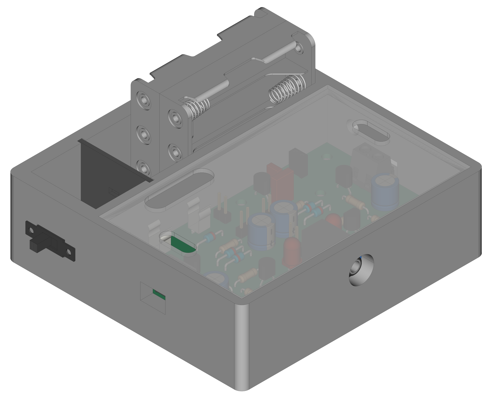
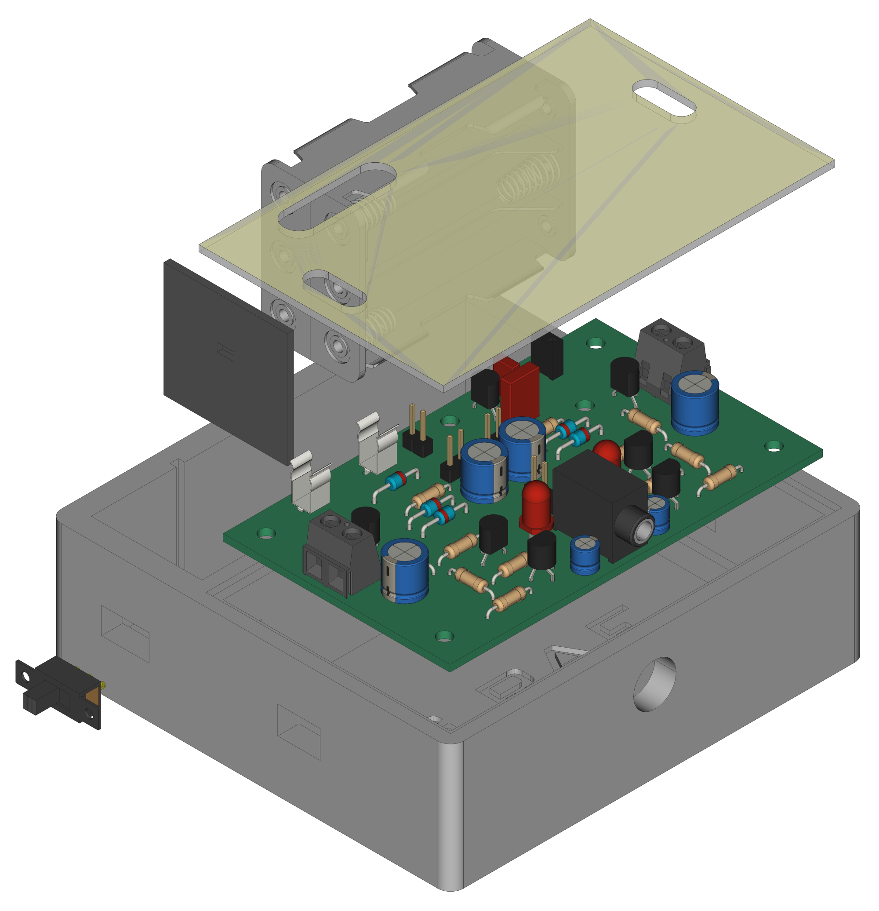

  

# `BSV` - (Bluetooth) Stereo Amplifier (Stereoverstärker)

The `BSV` project is based on a pcb with a transistor amplifier. It can be combined with a [Bluetooth audio module](https://eu.robotshop.com/de/products/bluetooth-50-audio-receiver-board) or with an audio jack only.

| Experience | Level |
|:------------|:-----:|
| Soldering   |  |
| Mechanical  |  |

# Downloads

| Type      | File               | Description              |
|:---------:|:------------------:|:-------------------------|
| Lochmaster | [lm4](https://github.com/0x007E/bsv/raw/refs/heads/main/BSV.LM4) | Stripe grid circuit board | 
| Schematic | [pdf](https://github.com/0x007E/bsv/releases/latest/download/schematic.pdf) / [cadlab](https://cadlab.io/project/28570/main/files)     | Schematic files          |
| Board     | [pdf](https://github.com/0x007E/bsv/releases/latest/download/pcb.pdf) / [cadlab](https://cadlab.io/project/28570/main/files)     | Board file               |
| Drill     | [pdf](https://github.com/0x007E/bsv/releases/latest/download/drill.pdf) | Drill file               |
| Gerber    | [zip](https://github.com/0x007E/bsv/releases/latest/download/kicad.zip) / [tar](https://github.com/0x007E/bsv/releases/latest/download/kicad.tar.gz)                | Gerber/Drill files       |
| Housing, PCB | [zip](https://github.com/0x007E/bsv/releases/latest/download/freecad.zip) / [tar](https://github.com/0x007E/bsv/releases/latest/download/freecad.tar.gz) | Housing and PCB (STEP) files     |

# Hardware

There are two parts of the hardware. The pcb and the housing of the `BSV`. The pcb is created with `KiCAD` and the housing with `FreeCAD`. All files are built with `github actions` so that they are ready for a production environment. The housing is printed with a 3D-printer (`Dremel 3D40`).

## PCB

The circuit board is populated on one side (Top). The best way for soldering is within a standard soldering system.

### Top Layer

### Bottom Layer

## Mechanical

The housing has a tolerance of `0.2mm` on each side of the case. So the pcb should fit perfectly in the housing. The tolerance can be modified with `FreeCAD` in the `Parameter` Spreadsheet.

### Assembled

#### Exploded

# Additional Information

| Type       | Link               | Description              |
|:----------:|:------------------:|:-------------------------|
| BC547 | [pdf](https://www.sparkfun.com/datasheets/Components/BC546.pdf) | NPN 
| BC327 | [pdf](https://www.onsemi.com/pdf/datasheet/bc327-d.pdf) | NPN 
| BC337 | [pdf](https://www.onsemi.cn/download/data-sheet/pdf/bc337-fsc-d.pdf) | PNP Transistor |

---

R. GAECHTER
